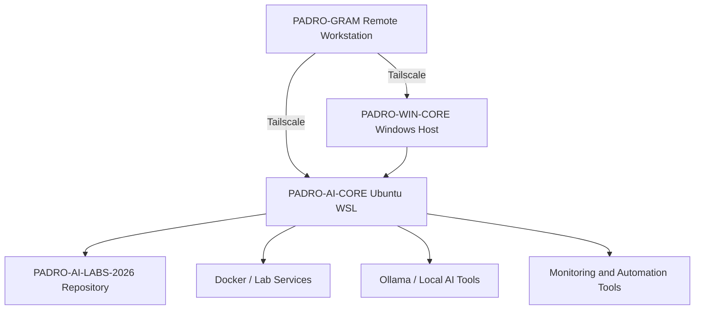
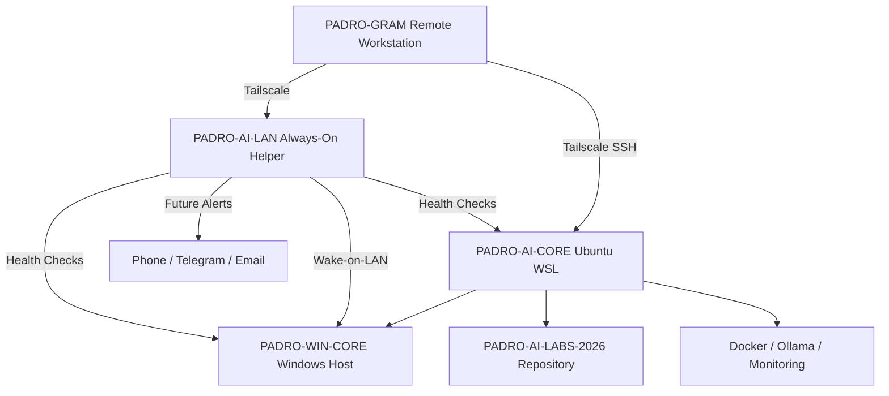

# Remote Access Diagram

## Current Design

## Future Design With Always-On LAN Helper

## Design Principle

The always-on helper is not the main lab. It is the recovery, monitoring, and availability node.

The main lab remains on PADRO-WIN-CORE and PADRO-AI-CORE. The helper exists to keep the environment reachable, observable, and recoverable.
